# aws-ha-webapp-alb-autoscaling

## Architecture Diagram


This project implements a highly available web application architecture in AWS using an Application Load Balancer and Auto Scaling Group.  
Traffic enters through an internet-facing ALB, is distributed across EC2 instances in private subnets, and scales dynamically based on CPU utilization.  
Outbound internet access for instances is handled via a Regional NAT Gateway.

---

## Key Design Decisions

- **Multi-AZ Design**  
  Application resources are distributed across two Availability Zones for high availability and fault tolerance.

- **Subnet Segmentation**  
  The VPC is structured into:
  - Public Subnet A (10.0.1.0/24) – us-east-1a  
  - Public Subnet B (10.0.2.0/24) – us-east-1b  
  - Private App Subnet A (10.0.11.0/24) – us-east-1a  
  - Private App Subnet B (10.0.12.0/24) – us-east-1b  

- **Route Table Design**
  - Public Route Table → 0.0.0.0/0 → Internet Gateway  
  - Private App Route Table → 0.0.0.0/0 → Regional NAT Gateway  

- **Security Group Chaining**
  - **alb-sg** → Allows HTTP (80) and HTTPS (443) from 0.0.0.0/0  
  - **app-sg** → Allows HTTP (80) from alb-sg and SSH (22) from bastion-sg  
  - **bastion-sg** → Allows SSH (22) from 0.0.0.0/0  

- **Auto Scaling Configuration**
  - Auto Scaling Group: **WebApp-ASG**  
  - Launch Template: **WebApp**  
  - Desired Capacity: 2  
  - Minimum Capacity: 2  
  - Maximum Capacity: 3  

- **Load Balancing**
  - Application Load Balancer: **WebApp-TG** *(named incorrectly; intended WebApp-ALB)*  
  - Target Group: **WebApp-TG**  
  - Health checks ensure only healthy instances receive traffic  

- **Regional NAT Gateway**  
  Provides outbound internet access for private application subnets across both AZs.

---

## Deployment Steps

1. Created VPC (10.0.0.0/16) with DNS enabled  
2. Created 4 subnets across 2 AZs (public + private app)  
3. Configured Internet Gateway and route tables  
4. Configured Regional NAT Gateway for outbound traffic  
5. Defined security groups:
   - alb-sg  
   - app-sg  
   - bastion-sg  
6. Created Launch Template (**WebApp**) with user data script  
7. Created Target Group (**WebApp-TG**) with HTTP health checks  
8. Deployed Application Load Balancer across public subnets  
9. Created Auto Scaling Group (**WebApp-ASG**) across private subnets  
10. Configured target tracking scaling policy (CPU utilization ~50%)  

---

## User Data Script

Located in: `configs/user-data.sh`

```bash
#!/bin/bash
dnf update -y
dnf install -y httpd
systemctl start httpd
systemctl enable httpd

TOKEN=$(curl -s -X PUT "http://169.254.169.254/latest/api/token" \
-H "X-aws-ec2-metadata-token-ttl-seconds: 21600")

INSTANCE_ID=$(curl -s -H "X-aws-ec2-metadata-token: $TOKEN" http://169.254.169.254/latest/meta-data/instance-id)

EC2_AVAIL_ZONE=$(curl -s -H "X-aws-ec2-metadata-token: $TOKEN" http://169.254.169.254/latest/meta-data/placement/availability-zone)

echo "<h1>Hostname: $(hostname -f)</h1>" > /var/www/html/index.html
echo "<h1>Instance ID: $INSTANCE_ID</h1>" >> /var/www/html/index.html
echo "<h1>AZ: $EC2_AVAIL_ZONE</h1>" >> /var/www/html/index.html```

## Load Balancing Validation

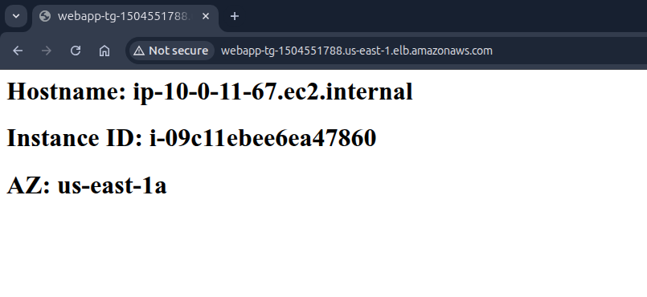  
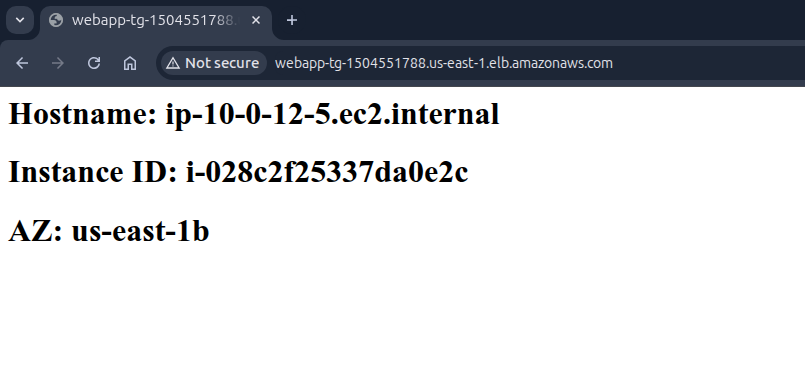

Refreshing the ALB DNS endpoint returns responses from different instances and Availability Zones, confirming traffic distribution across the Auto Scaling Group.

---

## Auto Scaling (Scale-Out Test)

Stress command used:
stress-ng --cpu 4 --cpu-load 90 --timeout 300s


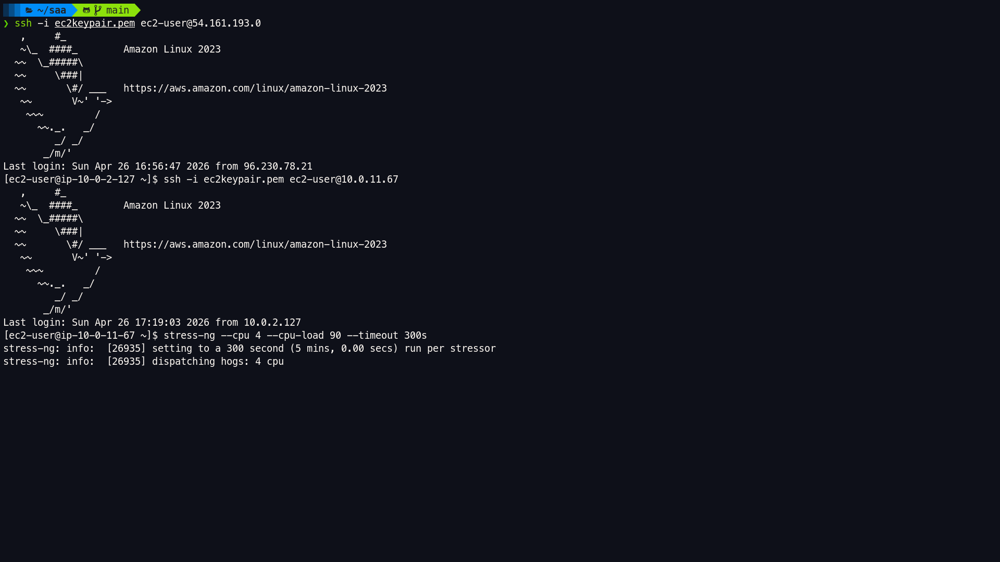  
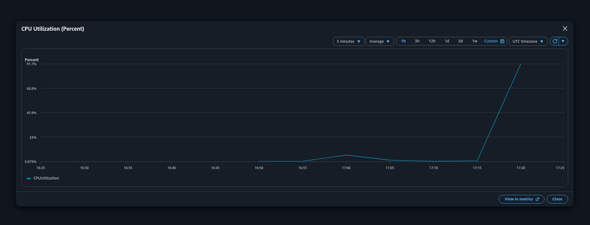  
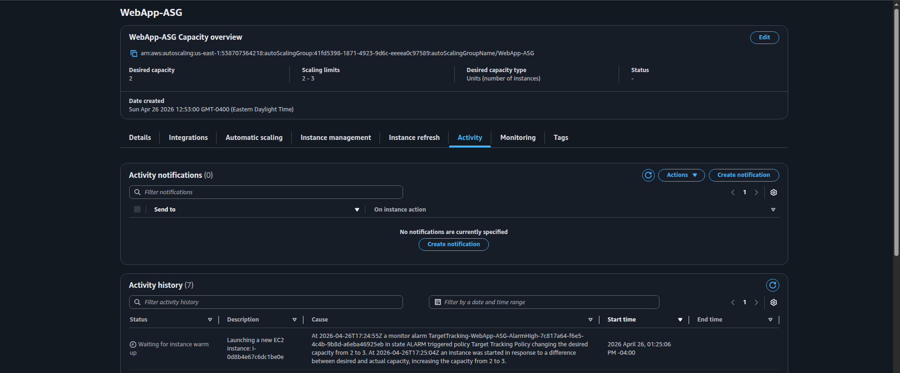  
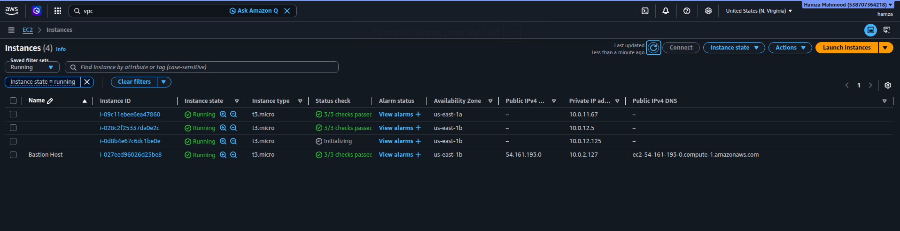  
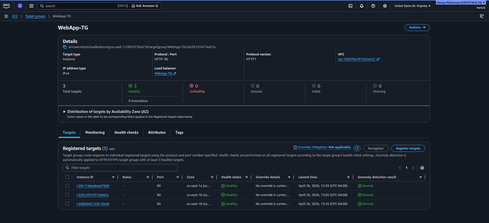

When CPU utilization exceeded the target threshold, the Auto Scaling Group launched a third instance automatically.

---

## Load Balancer Scaling Awareness

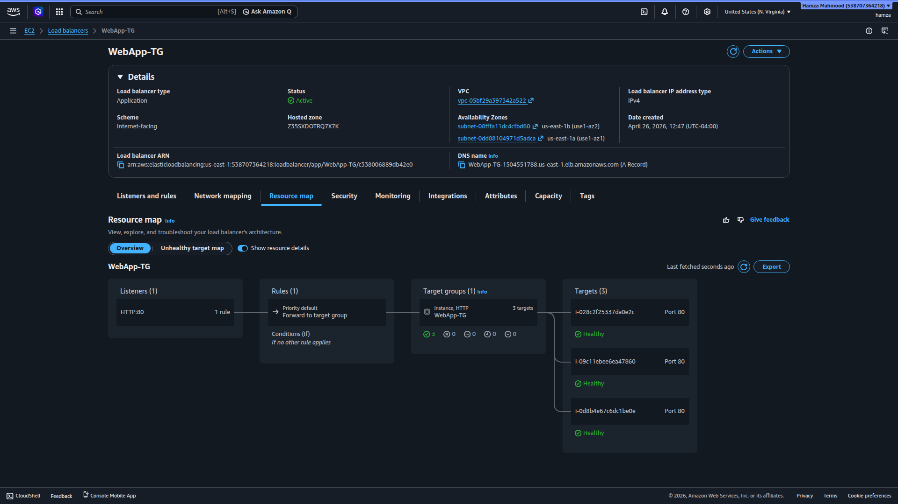  
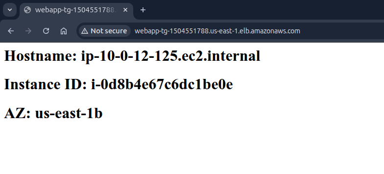

The ALB dynamically registered the new instance and began routing traffic to it without manual intervention.

---

## Instance Failure Simulation

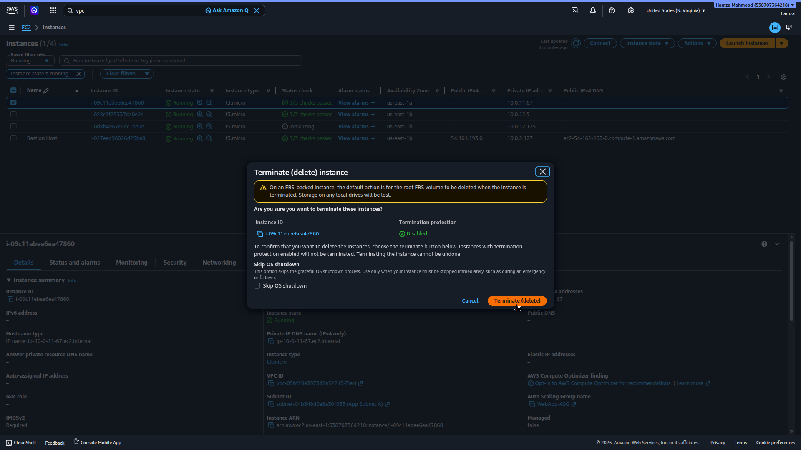  
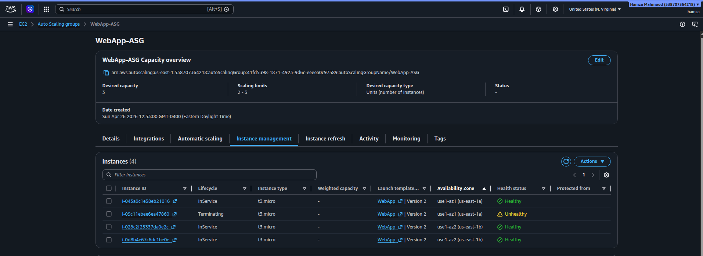  
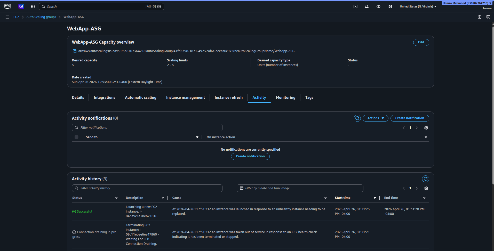  
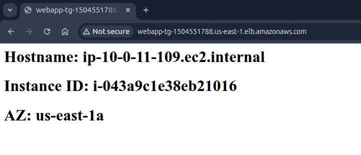

After manually terminating an instance, the Auto Scaling Group detected the failure and launched a replacement instance automatically.

---

## Final System State

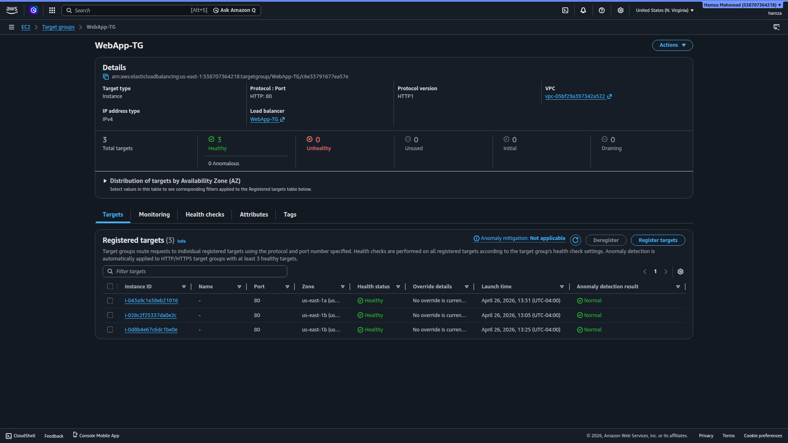

The system returned to a stable state with the desired number of healthy instances.

---

## Outbound Internet Access

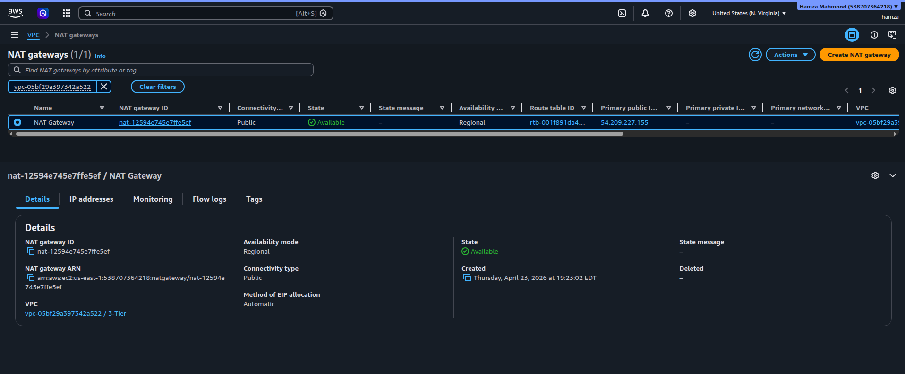

Private application instances access the internet via the Regional NAT Gateway for package installation and updates.

---

## What This Project Demonstrates

- High availability design using Multi-AZ deployment  
- Application Load Balancer configuration and traffic distribution  
- Auto Scaling Group configuration and dynamic scaling  
- Health checks and fault detection  
- Self-healing infrastructure (automatic instance replacement)  
- Private subnet architecture with controlled outbound access via NAT  
- Security group-based access control and tier isolation  
- EC2 automation using user data scripts with IMDSv2  

---

## Supporting Artifacts

This repository includes supporting materials used to validate and document the deployment:

- **[screenshots/](./screenshots/)**  
  Contains evidence of architecture behavior, including load balancing, scaling events, and failure recovery.

- **[configs/](./configs/)**  
  Contains:
  - `user-data.sh` → EC2 initialization script  
  - `stress-command` → CPU stress test used to trigger scaling  

These artifacts provide reproducibility and validation of the highly available web application architecture.